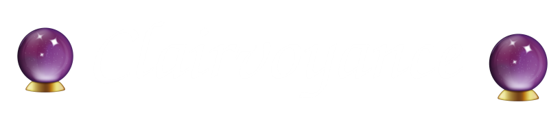

  

  

# Purpose

A parents' #1 priority is the safety of their children, but in some cases, such as while riding a school bus, students are increasingly susceptible to danger. And so, by developing a system of communication between bus drivers and parents relaying delays, location, and messaging, we can help ensure the protection of the youth.

# About This Project

This project is a submission for Equitable Elevation II. Find more information here: https://equitable-elevation-ii.devpost.com/?ref_feature=challenge&ref_medium=discover
